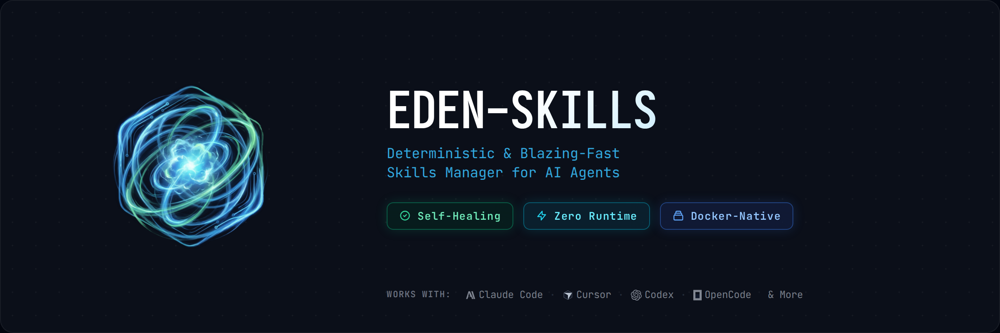

<div align="center"> <!-- markdownlint-disable-line -->
   <!-- markdownlint-disable-line -->
</div>

# eden-skills

[](https://github.com/AI-Eden/eden-skills/actions/workflows/ci.yml)
[](https://crates.io/crates/eden-skills)
[](https://crates.io/crates/eden-skills)

Deterministic, self-healing skills manager for AI agents. Single binary. Zero runtime dependencies.

*Built by a [three-model AI engineering team](#built-with-agentic-engineering) — 38K lines of Rust, 476 tests, 57 behavior specs.*

## Why eden-skills

- **Installs are deterministic:** `skills.lock` pins every installed skill by commit SHA and target path. Run `apply` on any machine and get exactly the same state — like Terraform for agent skills.

- **Broken installs self-heal:** `doctor` detects broken symlinks, missing sources, drift, and risk findings. Use `doctor --no-warning` when you want an error-focused view. `repair` fixes recoverable drift automatically. No competitor offers this.

- **Config is code:** `skills.toml` is your single source of truth. Version it, share it with your team, and `apply` it anywhere.

- **Docker-native:** Install skills directly into running containers with `--target docker:<container>`. Use `docker mount-hint` to configure bind mounts for live sync.

- **Zero runtime:** Single ~10 MB binary. No Node.js, no npm, no Python — just `eden-skills` and `git`.

## Quick Start

**Prerequisite:** Git

**Linux / macOS:**

```bash
curl -fsSL https://raw.githubusercontent.com/AI-Eden/eden-skills/main/install.sh | bash
```

**Windows (PowerShell):**

```powershell
irm https://raw.githubusercontent.com/AI-Eden/eden-skills/main/install.ps1 | iex
```

<details> <!-- markdownlint-disable-line -->
<summary>Alternative: install via Cargo or from source</summary> <!-- markdownlint-disable-line -->

```bash
cargo install eden-skills --locked
```

```bash
git clone https://github.com/AI-Eden/eden-skills.git
cd eden-skills
cargo install --path crates/eden-skills-cli --locked --force
```

</details>

**Install your first skill:**

```bash
eden-skills install vercel-labs/agent-skills
```

Auto-detects installed agents (Claude Code, Cursor, Codex, Windsurf, etc.) and links the skill to each. When multiple skills are found, an interactive selector appears.

**Verify the installation is healthy:**

```bash
eden-skills doctor
```

If anything is broken:

```bash
eden-skills repair
```

## See It In Action

Interactive install, simulated damage, and self-healing recovery:

<div align="center"> <!-- markdownlint-disable-line -->
   <!-- markdownlint-disable-line -->
</div>

## Commands

| Command | Description |
| --- | --- |
| `install <source>` | Install skills from GitHub, URL, or local path |
| `remove [skills...]` | Remove skills (batch or interactive) |
| `list` | List installed skills and their source origins |
| `apply` | Reconcile all skills to the desired config state |
| `plan` | Preview planned changes (read-only) |
| `doctor` | Detect broken links, drift, and risk findings (`--no-warning` hides warnings) |
| `repair` | Self-heal broken symlinks and drifted state |
| `update` | Sync registry indexes to latest |
| `clean` | Remove orphaned repo-cache entries and stale temp directories |
| `init` | Initialize a new `skills.toml` config |
| `add` / `set` | Add or update skill entries in config |
| `config export` / `import` | Export or import config |
| `docker mount-hint` | Show recommended bind mounts for a container |

See [CLI Reference](docs/07-cli-reference.md) for full options, flags, and examples.

## Supported Agents

40+ agents including Claude Code, Cursor, Codex, Windsurf, Gemini CLI, GitHub Copilot, Cline, Roo, Continue, and more. Docker containers (`docker:<name>`) and arbitrary paths (`custom:<path>`) are also supported.

See [full agent list](docs/07-cli-reference.md#supported-agents).

## Documentation

1. [Quickstart: First Successful Run](docs/01-quickstart.md)
2. [Config Lifecycle Management](docs/02-config-lifecycle.md)
3. [Registry and Install Workflow](docs/03-registry-and-install.md)
4. [Docker Targets Guide](docs/04-docker-targets.md)
5. [Safety, Strict Mode, and Exit Codes](docs/05-safety-strict-and-exit-codes.md)
6. [Troubleshooting Playbook](docs/06-troubleshooting.md)
7. [CLI Reference](docs/07-cli-reference.md)
8. [Agentic Engineering Workflow](docs/agentic-workflow.md)

## Current Status

- Phase 1 (CLI foundation): complete
- Phase 2 (async reactor, Docker adapter, registry): complete
- Phase 2.5 (URL install, agent auto-detection, binary distribution): complete
- Phase 2.7 – 2.98 (lock file, TUI, output polish, interactive UX, cache clean, doctor/list polish): complete
- Phase 3 (crawler / taxonomy / curation): planned

`eden-skills` is under active development. Avoid production use where breaking changes are not tolerable.

## Repository Layout

- [`crates/eden-skills-core`](crates/eden-skills-core) — domain logic (config, plan, verify, safety, reactor, adapter, registry)
- [`crates/eden-skills-cli`](crates/eden-skills-cli) — user-facing CLI binary
- [`crates/eden-skills-indexer`](crates/eden-skills-indexer) — Phase 3 placeholder
- [`spec/`](spec/) — normative behavior contracts ([index](spec/README.md))
- [`docs/`](docs/) — tutorials and guides
- [`prompt/`](prompt/) — agentic engineering kick files ([workflow guide](docs/agentic-workflow.md))

## Built with Agentic Engineering

eden-skills was built using a three-model AI collaboration workflow:

- **Scout** (Gemini) — market research, competitive analysis, roadmap planning
- **Architect** (Claude) — behavior spec authoring, architecture decisions, large-scale refactoring
- **Builder** (GPT) — implementation from specs, tests, CI integration

The [`prompt/`](prompt/) directory contains the complete set of kick files — role-scoped prompts with identity constraints, pre-flight checks, and batch/handoff protocols. Each prompt enforces strict role boundaries: the Architect cannot write code; the Builder cannot modify specs.

The 62 spec files under `spec/` are not a barrier to contribution — they are the Architect agent's work product. You do not need to write specs yourself. See the [Agentic Workflow Guide](docs/agentic-workflow.md) to learn how to use AI agents to contribute to this project.

## Contributing

Contributions welcome — issues, bug reports, docs, tests, and pull requests.

To understand the development workflow, start with the [Agentic Workflow Guide](docs/agentic-workflow.md). For normative behavior contracts, see [`spec/`](spec/). Track progress in [`STATUS.yaml`](STATUS.yaml) and [`EXECUTION_TRACKER.md`](EXECUTION_TRACKER.md). See the [Roadmap](ROADMAP.md) for strategic milestones.
